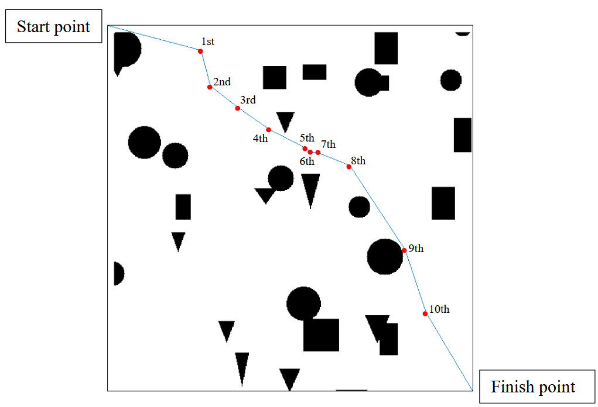

# GA optimal path finder
A simple [genetic algorithm](https://www.geeksforgeeks.org/genetic-algorithms/) implementation involving a series of selection, crossover, mutation methods that minimises a fitness function to find an optimal path given any bitmap image of obstacles, from a starting point to finish. 

#### Example obstacle image and solution

## Breakdown of methods
Selection methods:
- Roulette Wheel 
- Tournament 
- Rank-based 

Crossover methods:
- k-point
- Uniform

Mutation methods:
- Bit-flip
- Bit-swap

## Running the code
You need to have at least MATLAB 2020a or later versions + few more adds-on to be install inside MATLAB as required when the program is run.
1. Clone the repo
2. Run the main.m file from the directory in MATLAB in the console
3. Install any adds-on needed, as outputed
4. The result png is overwriten to the same bmp image, and is displayed automatically once the algorithm converges